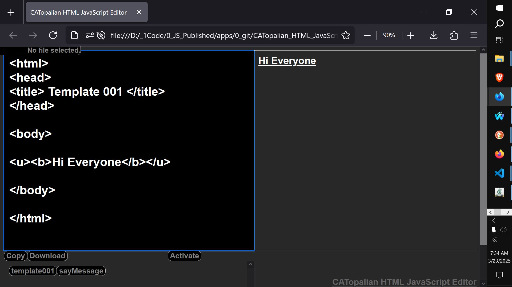

# CATopalian HTML JavaScript Editor
A JavaScript application that is an HTML JavaScript Code Editor that can edit code, run JavaScript, render HTML and save and load files.  

USE APP: https://christopherandrewtopalian.github.io/CATopalian_HTML_JavaScript_Editor/CATopalian_HTML_JavaScript_Editor.html

---

### How to Download this App
1. Click the green Code Button on this github page
2. Choose Download ZIP
3. Save the Zip File
4. Extract All
5. Double click the HTML file to start the App

---

Happy Scripting :-)

